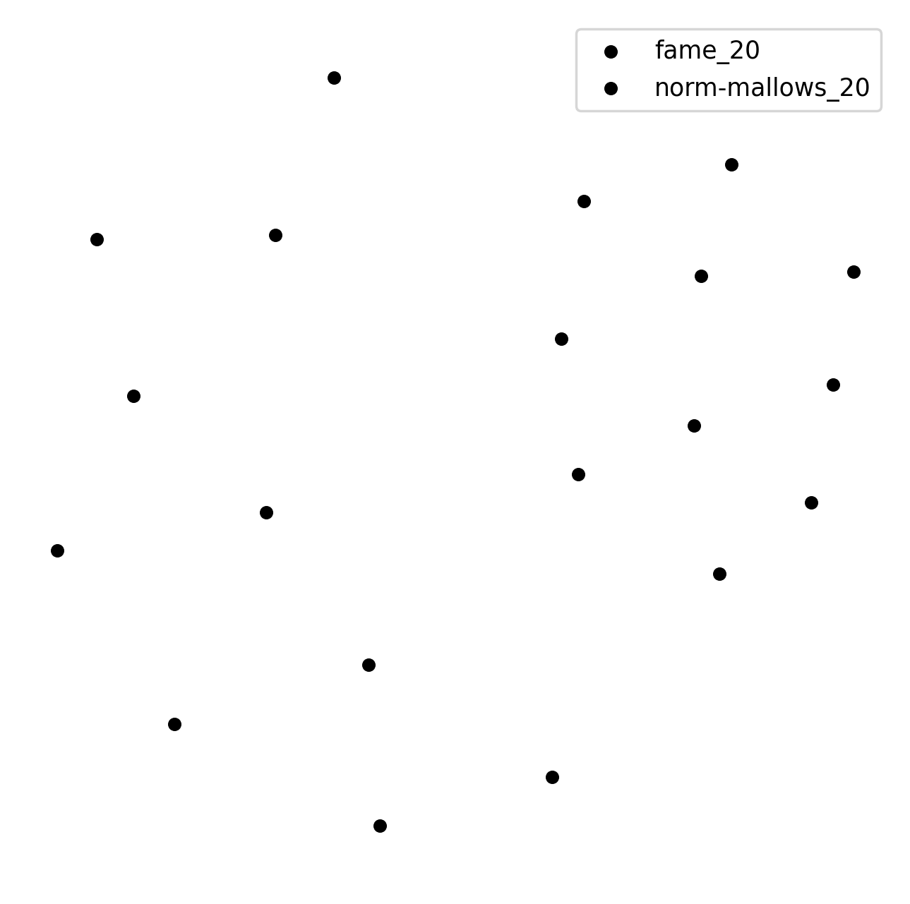
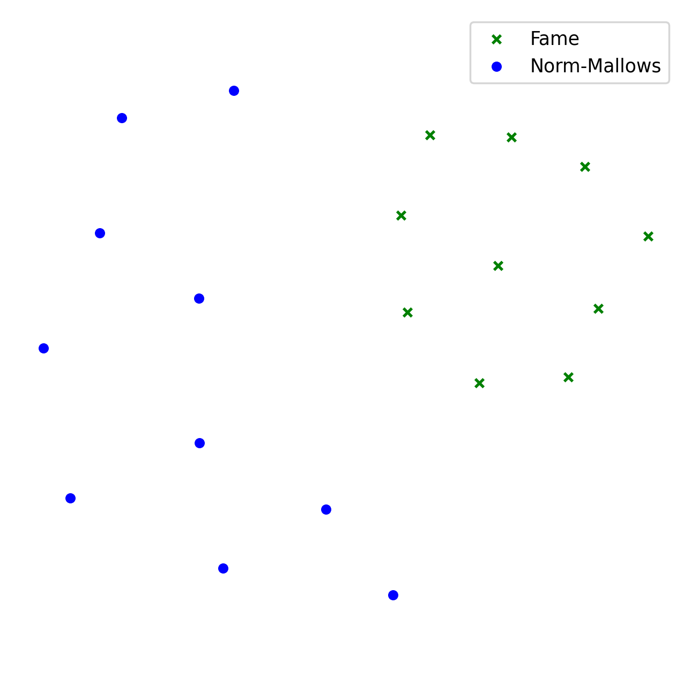
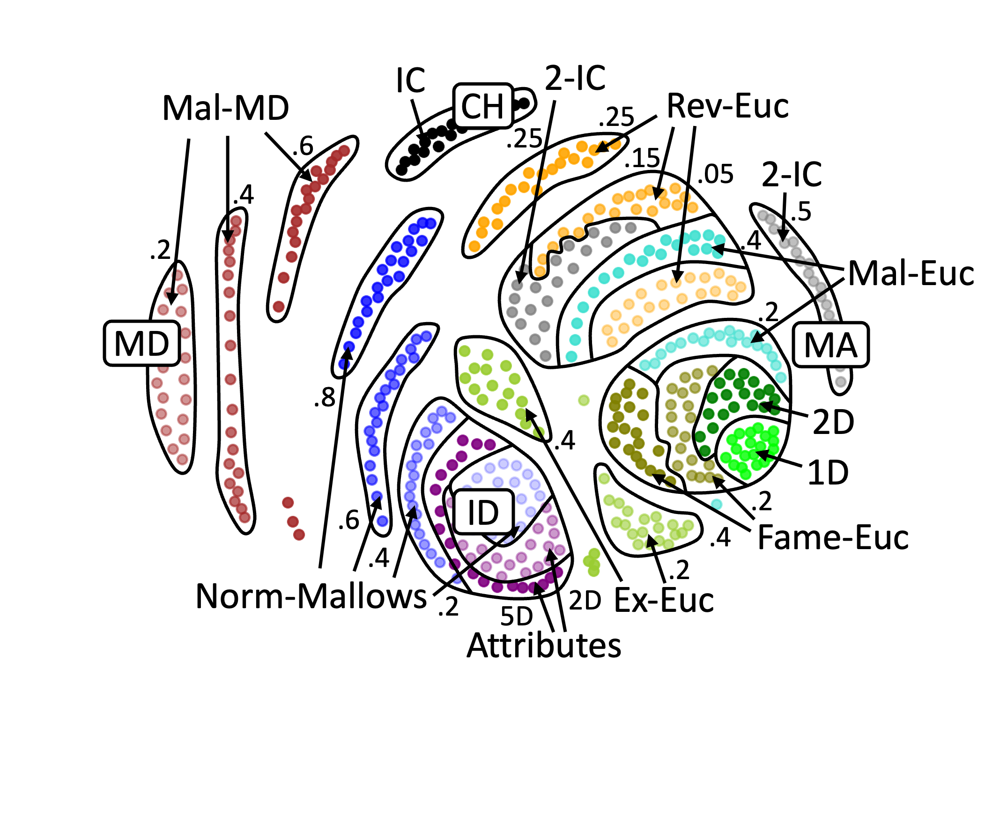

.. _quickstart:

Quick Start
===========

Import
------

To import mapof-roommates python package:

.. code-block:: python

    import mapof.roommates as mapof

General Tasks
-------------

.. _generate_roommates_instance:

Generate SR Instance from Statistical Culture
~~~~~~~~~~~~~~~~~~~~~~~~~~~~~~~~~~~~~~~~~~~~~~~~~~~~~~~~~~~

.. raw:: html

    

        <strong>Objective</strong>
        <em>Generate impartial culture instance with 10 agents.</em>
    

In this section, you will learn how to generate stable roommates instances from different statistical cultures.
We will start by defining what we mean by a stable roommates instances.
Formally, a stable roommates (SR) instance consists of a set of agents, with each agent having a preference order over all other agents.

In practice, we represent an SR instance by ``RoommatesInstance`` object, which among other fields, contains:

.. code-block:: python

    instance.num_agents     # number of agents
    instance.votes          # preference orders

By ``votes``, we refer to a two-dimensional array ``list[list[int]]``, where each row represents a single agent (i.e., vote).

E.g., ``votes = [[1,2,3],[2,0,3],[3,1,0],[0,2,1]`` refers to an instance with four following votes:

::

    1 ≻ 2 ≻ 3
    2 ≻ 0 ≻ 3
    3 ≻ 1 ≻ 0
    0 ≻ 2 ≻ 1

.. raw:: html

    

    <strong>Solution</strong>
    To generate an SR instance we use the ``generate_roommates_instance()`` function:
    

.. code-block:: python

    instance = mapof.generate_roommates_instance(culture_id='impartial', num_agents=10)

The list of all implemented cultures can be found in :ref:`list_of_cultures`.

If you want to add your own culture, you can do this by using the ``add_culture()`` function.

.. code-block:: python

    experiment.add_culture("my_name", my_func)

The function takes two arguments: The first one is the name of the new culture,
and the second one is the function that generates the votes.
The function that generates the votes can take any number of arguments,
but the first one should be ``num_agents`` parameter.
Moreover, the function should return votes as a list of list.
Technically the signature is as follows:

.. code-block:: python

    my_func(num_agents: int, **kwargs) -> list[list[int]]:

Compute Distance between Two SR Instances
~~~~~~~~~~~~~~~~~~~~~~~~~~~~~~~~~~~~~~~~~

.. raw:: html

    

    <strong>Objective</strong>
    <em>Compute the l1-mutual_attraction distance between two SR instances.</em>
    

To compute a distance, use the ``compute_distance`` function, which takes two instances and a ``distance_id`` as input.

.. code-block:: python

   distances, mapping = mapof.compute_distance(
                                       instance_1,
                                       instance_2,
                                       distance_id='l1-mutual_attraction')

This function returns a tuple containing the distance and the mapping that witnesses this distance. If a given distance does not use a mapping, it returns ``None`` instead.

.. raw:: html

    

    <strong>Solution</strong>
    We start by generating two instances, and then we compute the distance:
    

.. code-block:: python

   instance_1 = mapof.generate_roommates_instance(culture_id='impartial', num_agents=6)
   instance_2 = mapof.generate_roommates_instance(culture_id='impartial', num_agents=6)
   distance, mapping = mapof.compute_distance(
                                           instance_1,
                                           instance_2,
                                           distance_id='l1-mutual_attraction')

A list of all implemented distances is available in :ref:`list_of_distances`.

.. _experiments:

Experiments
-----------

Generate SR Instances as Part of Experiment
~~~~~~~~~~~~~~~~~~~~~~~~~~~~~~~~~~~~~~~~~~~

.. raw:: html

    

    <strong>Objective</strong>
    <em>Generate (within experiment) impartial culture instance with 16 agents voters</em>
    

In this section, we introduce an abstract object called ``Experiment``, which helps us keep things clear. Finally, we generate instances using the ``Experiment`` object.

An ``Experiment`` is an abstract object, which, for now, can be seen as a black box in which all the computation takes place. At first, it might be confusing, but in the long run, it simplifies things.
Before carrying out any other operations we need to create an empty ``Experiment``.
For this, we use the function ``prepare_online_ordinal_experiment()``,
which returns an empty ``Experiment``. So, in order to prepare an empty ``Experiment``, type:

.. code-block:: python

    experiment = mapof.prepare_online_roommates_experiment()

To give you a hint of what the ``Experiment`` is, we present some of its fields and methods:

.. code-block:: python

    experiment.instances
    experiment.distances
    experiment.coordinates
    experiment.features

    experiment.add_instance()
    experiment.add_family()
    experiment.compute_distances()
    experiment.embed_2d()
    experiment.compute_feature()
    experiment.print_map_2d()

Now, we will focus on the ``add_instance()`` method. In order to generate an instance,
it suffices to run the ``add_instance()`` method, and specify the ``culture_id``.
For example, if we want to generate an instance from impartial culture, we type:

.. code-block:: python

    experiment.add_instance(culture_id='impartial')

All instances added to the experiment are stored in an ``experiment.instances`` dictionary, where the key is the ``instance_id``, and the value is the ``Instance`` object. If you want to specify your own ``instance_id``, you can do so using the ``instance_id`` argument, for example:

.. code-block:: python

    experiment.add_instance(culture_id='impartial', instance_id='IC')

By default, the generated instance will have 20 agents. However, if you want to generate an instance with a different number of agents, use the ``num_agents`` argument:

.. code-block:: python

    experiment.add_instance(culture_id='impartial', num_agents=20)

If you want to change the default value not for a single SR instance, but for all instances generated in the future, type:

.. code-block:: python

    experiment.set_default_num_agents(20)

.. raw:: html

    

    <strong>Solution</strong> Our aim was to generate an impartial culture instance (with 16 agents) within the experiment.
    Below we present the code with the solution.
    

.. code-block:: python

    experiment = mapof.prepare_online_roommates_experiment()
    experiment.add_instance(culture_id='impartial', num_agents=16)

Generate Family of SR Instances
~~~~~~~~~~~~~~~~~~~~~~~~~~~~~~~

.. raw:: html

    

    <strong>Objective</strong> <em>Generate 20 instances from Normalized Mallows culture with norm-ϕ = 0.5</em>
    

If you would like to add many instances from the same culture, instead of adding them one by one, you can add them as one family of instances.

.. code-block:: python

    experiment.add_family(culture_id='impartial', size=10)

The main difference between ``add_instance`` and ``add_family`` is the fact that the latter function has an additional argument called size,
which specifies how many instances from a given distribution will be created.

Moreover, note that instead of impartial culture, we want to generate Normalized Mallows instances,
which are parameterized by norm-ϕ
To generate a single Normalized Mallows instance with norm-ϕ = 0.5, we should type:

.. code-block:: python

    experiment.add_instance(culture_id='norm-mallows', normphi=0.5)

.. raw:: html

    

    <strong>Solution</strong> Joining the upper two things together we obtain the solution.
    

.. code-block:: python

    experiment = mapof.prepare_online_ordinal_experiment()
    experiment.add_family(culture_id='norm-mallows', size=10, normphi=0.5)

Create Map of SR Instances
~~~~~~~~~~~~~~~~~~~~~~~~~~

.. raw:: html

    

    <strong>Objective</strong> <em>Create a map of SR instances (from Fame and Norm-Mallows cultures)</em>
    

Creating a map of SR instances is an ultimate tool of this package.
We divide the procedure into four major steps,
which we describe in detail one by one,
with the exception of the first step which was described before.
The steps are the following:

1. Generate instances
2. Compute distances
3. Embed in 2D
4. Print the map

.. rubric:: Compute Distances

In order to compute distances between instances, use the following function:

.. code-block:: python

    experiment.compute_distances(distance_id='l1-mutual_attraction')

The distances are stored in the ``distances`` field, which is a dictionary of dictionaries.
If you want to access the distances, just type:

.. code-block:: python

    experiment.distances

**Example**

Let us assume that we have three instances generated from impartial culture with the following ids: ``ic_0, ic_1, ic_2``.
Then, the ``distances`` (dictionary of dictionaries) look as follows:

.. code-block:: python

    {'ic_0': {'ic_1': 2.3, 'ic_2': 1.7},
     'ic_1': {'ic_0': 2.3, 'ic_2': 1.9},
     'ic_2': {'ic_0': 1.7, 'ic_1': 1.9}}

.. rubric:: Embedding

In order to embed the instances into 2D Euclidean space, run:

.. code-block:: python

    experiment.embed_2d(embedding_id='kk')

The coordinates are stored in the ``coordinates`` field, which is a dictionary of lists. If you want to access the coordinates, just type:

.. code-block:: python

    experiment.coordinates

More information about different embedding algorithms is available in TBU.

**Example**

Let us assume that we have four instances generated from Normalized Mallows culture with the following ids: ``mal_0, mal_1, mal_2, mal_3``. Then, the ``coordinates`` (dictionary of lists) look as follows:

.. code-block:: python

    {'mal_1': [0.2, 0.8],
     'mal_2': [0.4, 0.4],
     'mal_3': [0.3, 0.1],
     'mal_4': [0.9, 0.7]}

.. rubric:: Printing

In order to print the map, run:

.. code-block:: python

    experiment.print_map_2d()

.. _fig_ex_1:

    Example 1.

.. _fig_ex_2:

    Example 2.

.. raw:: html

    

    <strong>Initial Solution</strong> After combining four steps described above we obtain the following code:
    

.. code-block:: python

    experiment = mapof.prepare_online_roommates_experiment()
    experiment.set_default_num_agents(20)
    experiment.add_family(culture_id='fame', size=10)
    experiment.add_family(culture_id='norm-mallows', size=10, normphi=0.33)
    experiment.compute_distances(distance_id='l1-mutual_attraction')
    experiment.embed_2d(embedding_id='kk')
    experiment.print_map_2d()

As a result of the code above, you will see two separate black clouds of points (see :ref:`fig_ex_1`). In order to make the map more pleasing, we can specify the colors/markers/label of each instance or family of instances separately. We do it via ``color``, ``marker``, ``label`` arguments.

.. raw:: html

    

    <strong>Improved Solution</strong>
    

.. code-block:: python

    experiment = mapof.prepare_online_roommates_experiment()
    experiment.set_default_num_agents(20)
    experiment.add_family(culture_id='fame', size=10,
                          color='green', marker='x', label='Fame')
    experiment.add_family(culture_id='norm-mallows', size=10,
                          normphi=0.33,
                          color='blue', marker='o',
                          label='Norm-Mallows')
    experiment.compute_distances(distance_id='l1-mutual_attraction')
    experiment.embed_2d(embedding_id='kk')
    experiment.print_map_2d()

.. _fig_original:

    Example 3: A map for the 200 dataset of Böhmer et al. [2024].

The picture created by the improved version is presented in :ref:`fig_ex_2`.
Moreover, for illustrative purposes, in :ref:`Example 3 <fig_original>`
we present the map for the 200 dataset of Böhmer et al. [2024]. Note that the labels and arrows are created in PowerPoint and are not part of the mapof software.

Coloring Map of SR Instances
~~~~~~~~~~~~~~~~~~~~~~~~~~~~

It is interesting to color the map according to certain statistics, referred to as features.

.. rubric:: Basic

We offer several pre-implemented features.
For example, if you would like to compute the highest plurality score for all instances, you can write:

.. code-block:: python

    experiment.compute_feature(feature_id='mutuality')

To print it, use the ``feature`` argument:

.. code-block:: python

    experiment.print_map_2d_colored_by_feature(feature_id='mutuality')

To access the computed values, type:

.. code-block:: python

    experiment.features['mutuality']

List of all the available features can be found in the :ref:`list_of_features`.

.. rubric:: Printing

Basic arguments for the ``print_map_2d`` function are the following:

.. code-block:: python

    saveas=str    # save file as xyz.png
    title=str     # title of the image
    legend=bool   # (by default True) if False then hide the legend
    ms=int        # (by default 20) size of the marker
    show=bool     # (by default True) if False then hide the map
    cmap          # cmap (only for printing features)

For example:

.. code-block:: python

    experiment.print_map_2d(title='My First Map', saveas='tmp', ms=30)

Offline Experiment
~~~~~~~~~~~~~~~~~~

Offline experiments are similar to online experiments
but offer the possibility to export/import files with instances, distances, coordinates, features, etc.

.. rubric:: Prepare Experiment

To prepare an offline experiment, run:

.. code-block:: python

    experiment = mapof.prepare_offline_roommates_experiment(
                            experiment_id='name_of_the_experiment')

The function above will create the experiment structure as follows:

.. code-block:: none

    experiment_id/
    ├── coordinates/
    ├── distances/
    ├── instances/
    ├── features/
    └── map.csv

.. rubric:: Prepare Instances

To prepare instances, run:

.. code-block:: python

    experiment.prepare_instances()

Instances are generated according to the `map.csv` file. An example `map.csv` file is created automatically when preparing the experiment.

.. rubric:: map.csv

The controlling `map.csv` file usually consists of:

- **size**: Number of instances to be generated from a given culture
- **num_agents**: Number of candidates
- **culture_id**: Code of the culture
- **params**: Dictionary with parameters of a given culture
- **color**: Color of the point(s) on the map
- **alpha**: Transparency of the point(s)
- **marker**: Marker of the point(s)
- **ms**: Marker size
- **label**: Label that will be printed in the legend
- **family_id**: Family ID
- **path**: Dictionary with parameters for generating a path of instances

.. rubric:: Imports

If some parts of your experiment are already precomputed, you can import them while preparing the experiment.
Ensure they are in the proper files. If they were precomputed using mapof, no additional steps are required.

If you want to import specific elements (different from default), specify them while preparing the experiment.
For transparency, it is recommended to always define them.

.. code-block:: python

    experiment = mapof.prepare_offline_ordinal_experiment(
                            experiment_id='name_of_the_experiment',
                            distance_id="l1-mutual_attraction'",
                            embedding_id="kk")

Regarding features, if they are precomputed, the program will import them while printing the map.
